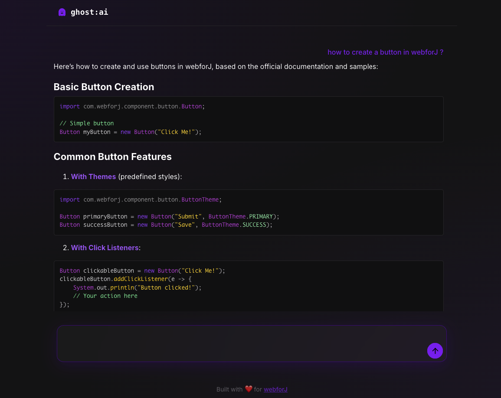

# ghost:ai

An AI chat demo built with webforJ and Spring AI, showcasing streaming markdown rendering, predictive text input, and MCP integration.




## Overview

This app demonstrates webforJ's AI-ready components integrated with Spring AI. Features a ChatGPT-style interface with streaming responses, syntax-highlighted code blocks, and intelligent text predictions.

## Features

- **Streaming Markdown**: Content renders live as it arrives from the LLM
- **Syntax Highlighting**: Code blocks highlight progressively with Prism.js
- **Predictive Text**: Ghost text suggestions as you type, Tab to accept
- **Chat Memory**: Conversation history preserved across messages
- **MCP Integration**: Connects to webforJ MCP Server for real-time documentation queries
- **Auto-scroll**: Smart scrolling that backs off when users scroll up

## Tech Stack

- **Frontend**: webforJ 25.11
- **Backend**: Spring Boot 3.5.8 with Spring AI
- **LLM**: Mistral AI via Spring AI
- **MCP**: webforJ MCP Server for documentation
- **Build Tool**: Maven
- **Java Version**: 21

## Getting Started

### Prerequisites

- Java 21
- Maven 3.9+
- Mistral AI API key

### API Key Setup

This app uses Mistral AI as the LLM. To get your API key:

1. Go to [Mistral AI Console](https://console.mistral.ai/api-keys)
2. Sign in or create an account
3. Create a new API key
4. Copy the key and add it to `src/main/resources/application.properties`:

```properties
spring.ai.mistralai.api-key=YOUR_API_KEY_HERE
```

### Running the App

1. Clone the repository:
```bash
git clone https://github.com/webforj/built-with-webforj.git
cd built-with-webforj/webforj-ghostai
```

2. Run the application:
```bash
mvn spring-boot:run
```

3. Open your browser and navigate to:
```
http://localhost:8080
```

## Learn More

- [webforJ Documentation](https://docs.webforj.com)
- [Spring AI Documentation](https://docs.spring.io/spring-ai/reference/)
- [webforJ MCP Server](https://docs.webforj.com/docs/introduction/mcp)
